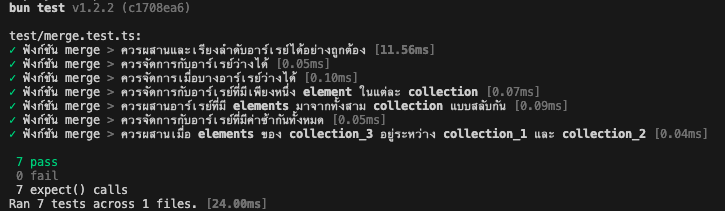

# Array Merge API

O(N) linear time ใช้ได้เฉพาะที่ array ที่อยู่ในเงื่อนไข collection_1,collection_2 เรียงจากน้อยไปมาก และ collection_3 จากมากไปน้อยเท่านั้น ( โจทย์กำหนดมา collection_1,collection_2 เรียงจากน้อยไปมาก และ collection_3 จากมากไปน้อย )


## 🚀 Quick Start
### execute code and unit test
```bash
# Install dependencies
bun install
```
```bash
# Run the server
bun run dev
```
```bash
# Run tests
bun test
```


API Usage
POST /merge
Merges and sorts three arrays of integers.

Request:
```bash
curl -X POST http://localhost:3000/merge \
  -H "Content-Type: application/json" \
  -d '{
    "collection_1": [1, 4, 7],
    "collection_2": [2, 5, 8],
    "collection_3": [9, 6, 3]
  }'
```
```bash
  Response:{
  "result": [1, 2, 3, 4, 5, 6, 7, 8, 9]
}
```

test ex : 


Built With
Bun - JavaScript runtime & package manager
Elysia - TypeScript web framework
TypeScript# testprimo
